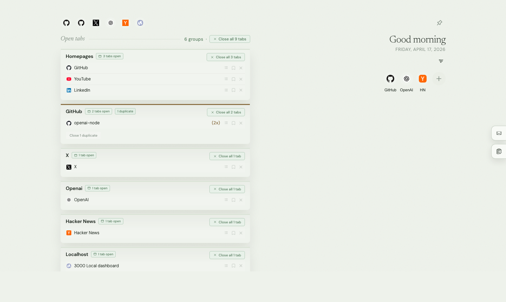
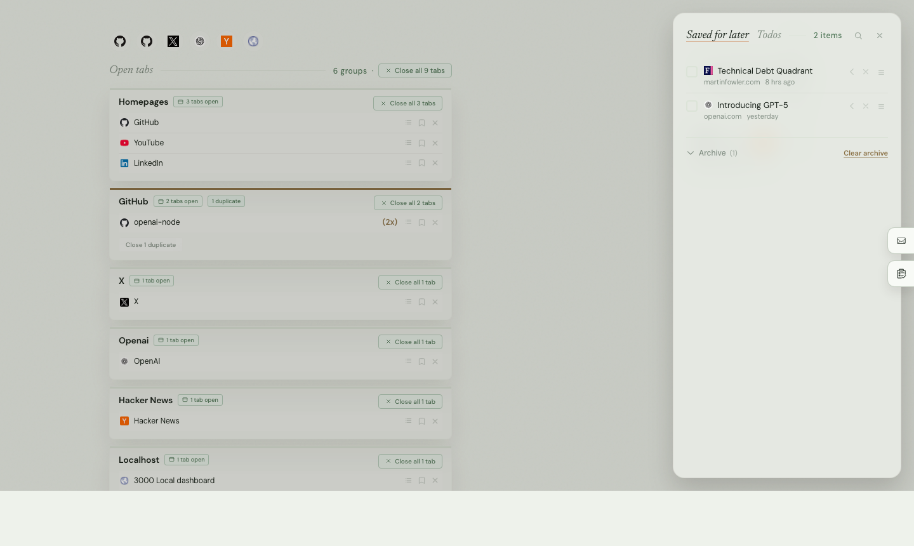

# Tab Harbor

[English](README.md) | [简体中文](README.zh-CN.md)

**A new tab dashboard for organizing open tabs, quick links, todos, and saved reads in one calm workspace.**

Tab Harbor turns Chrome's new tab page into something you can actually work from. Instead of opening one more empty tab and immediately getting lost again, you land in a quiet dashboard that shows what is already open, what should be saved for later, and what still needs your attention.

It is built for the kind of browsing that turns into research, shipping, side quests, and thirty tabs you swear are all still useful.

## ✨ Preview

Here is the main dashboard view, with open tabs grouped into readable stacks instead of one endless strip.



And here is the side drawer for saved reads, where pages can sit for later without getting buried forever.



## 🌊 Why Tab Harbor

Most new tab pages try to be a search box, a wallpaper, or a speed dial. Tab Harbor is closer to a lightweight control room. It keeps the messy reality of browsing visible, but turns it into something calmer: domains are grouped, homepage tabs are pulled into their own space, duplicates are easy to spot, and the “I need this, just not right now” pages finally have a home.

It also goes beyond tab cleanup. You can keep a row of quick links for the pages you open constantly, manage a small todo list without leaving the tab page, and build a read-later queue that feels closer to a working inbox than a pile of forgotten bookmarks.

## 🧭 Features

- Group open tabs by domain so related pages stay together automatically
- Pull homepage tabs like GitHub, YouTube, LinkedIn, X, and similar entry pages into a dedicated Homepages group
- Jump to any open tab directly from the dashboard without opening duplicates
- Detect duplicate pages and clean them up with one click
- Detect duplicate Tab Harbor tabs and close the extras from the top banner
- Save pages for later before closing them, then revisit them from the side drawer
- Archive saved pages after you are done with them
- Search saved pages and archived items from inside the drawer
- Create and manage todos directly from the new tab page
- Archive completed todos while keeping active work visible
- Search todos and open a simple detail view for longer notes
- Add quick links for the pages you open all the time
- Show localhost tabs with port numbers so local projects are easier to tell apart
- Expand large groups without losing the clean overview
- Create manual groups and move tabs into them when domain-based grouping is not enough
- Reorder groups from the top nav so your workflow stays in the order you want
- Reorder saved pages and todos inside the drawer
- Switch themes, change transparency, and use a custom background image
- Keep everything local with no server, no account, and no external API dependency

## ⚡ Quick Use

### Install with a coding agent

1. Give your coding agent this repo:

   ```text
   https://github.com/V-IOLE-T/tab-harbor
   ```

2. Ask it to install the extension.
3. Open a new tab in Chrome.

### Install manually

1. Clone this repo:

   ```bash
   git clone https://github.com/V-IOLE-T/tab-harbor.git
   ```

2. Open `chrome://extensions`
3. Turn on **Developer mode**
4. Click **Load unpacked**
5. Select the [`extension/`](extension/) folder
6. Open a new tab

## 🪴 What It Feels Like

A good session in Tab Harbor feels less like “tab management” and more like having your browser desk cleaned up just enough to think again. Your working tabs stay visible, your future-reading pile moves to the side instead of disappearing, and the next action is usually one click away.

That is also why the extension tries to stay lightweight. There is no sync story to set up, no backend to trust, and no extra app to open. It lives where the mess already happens.

## 🔒 Fully Local

Tab Harbor runs entirely inside the extension. Open tabs are read directly from Chrome, and your saved pages, todos, quick links, theme settings, and layout preferences stay on your machine through `chrome.storage.local`.

If you publish this repo for other people, they get the code and assets, not your personal browsing data.

## 🛠️ Under the Hood

This is a Manifest V3 Chrome extension with a plain frontend stack and no build step required to use it. The interface is driven by browser APIs, local storage, and a small amount of animation polish for actions like cleanup and closing flows.

That means you can clone it, load it, and start using it without npm, without a dev server, and without standing up anything else.

## 📄 License

MIT.
